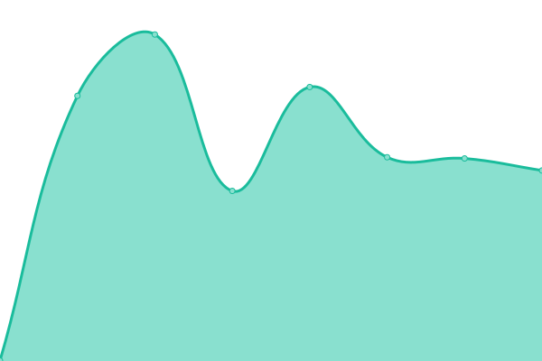
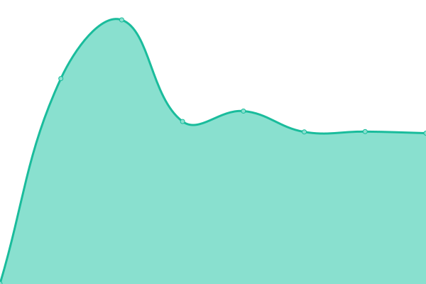
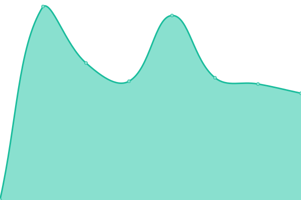

# [📈 Live Status](https://emothek.github.io/lets_upptime): <!--live status--> **🟩 All systems operational**

This repository contains the open-source uptime monitor and status page for [Mokhtar Megherbi](https://emothek.github.io/lets_upptime), powered by [Upptime](https://github.com/upptime/upptime).

With [Upptime](https://upptime.js.org), you can get your own unlimited and free uptime monitor and status page, powered entirely by a GitHub repository. We use [Issues](https://github.com/emothek/lets_upptime/issues) as incident reports, [Actions](https://github.com/emothek/lets_upptime/actions) as uptime monitors, and [Pages](https://emothek.github.io/lets_upptime) for the status page.

<!--start: status pages-->
<!-- This summary is generated by Upptime (https://github.com/upptime/upptime) -->
<!-- Do not edit this manually, your changes will be overwritten -->
<!-- prettier-ignore -->
| URL | Status | History | Response Time | Uptime |
| --- | ------ | ------- | ------------- | ------ |
|  [Letsact landing page](https://letsact.de) | 🟩 Up | [letsact-landing-page.yml](https://github.com/emothek/lets_upptime/commits/HEAD/history/letsact-landing-page.yml) | 

 254ms
     
 | 

<a href="https://emothek.github.io/lets_upptime/history/letsact-landing-page">100.00%</a>
    

|  [Lets landing page](https://joinlets.de) | 🟩 Up | [lets-landing-page.yml](https://github.com/emothek/lets_upptime/commits/HEAD/history/lets-landing-page.yml) | 

 960ms
     
 | 

<a href="https://emothek.github.io/lets_upptime/history/lets-landing-page">100.00%</a>
    

|  [Joinlets](https://app.joinlets.de) | 🟩 Up | [joinlets.yml](https://github.com/emothek/lets_upptime/commits/HEAD/history/joinlets.yml) | 

 629ms
     
 | 

<a href="https://emothek.github.io/lets_upptime/history/joinlets">100.00%</a>
    

|  [Unsekinder](https://undekinder.joinlets.de) | 🟩 Up | [unsekinder.yml](https://github.com/emothek/lets_upptime/commits/HEAD/history/unsekinder.yml) | 

 669ms
     
 | 

<a href="https://emothek.github.io/lets_upptime/history/unsekinder">100.00%</a>
    

|  [FondsFinanz](https://fondsfinanz.joinlets.de) | 🟩 Up | [fonds-finanz.yml](https://github.com/emothek/lets_upptime/commits/HEAD/history/fonds-finanz.yml) | 

 565ms
     
 | 

<a href="https://emothek.github.io/lets_upptime/history/fonds-finanz">100.00%</a>
    

|  [Die Bayerische](https://diebayerische.joinlets.de) | 🟩 Up | [die-bayerische.yml](https://github.com/emothek/lets_upptime/commits/HEAD/history/die-bayerische.yml) | 

 586ms
     
 | 

<a href="https://emothek.github.io/lets_upptime/history/die-bayerische">100.00%</a>
    

|  [New Letsact web 2](https://app.letsact.de) | 🟩 Up | [new-letsact-web-2.yml](https://github.com/emothek/lets_upptime/commits/HEAD/history/new-letsact-web-2.yml) | 

 596ms
     
 | 

<a href="https://emothek.github.io/lets_upptime/history/new-letsact-web-2">100.00%</a>
    

|  [Letsact Org tool](https://org.letsact.de) | 🟩 Up | [letsact-org-tool.yml](https://github.com/emothek/lets_upptime/commits/HEAD/history/letsact-org-tool.yml) | 

 558ms
     
 | 

<a href="https://emothek.github.io/lets_upptime/history/letsact-org-tool">100.00%</a>
    

<!--end: status pages-->

[**Visit our status website →**](https://emothek.github.io/lets_upptime)

## 📄 License

- Powered by: [Upptime](https://github.com/upptime/upptime)
- Code: [MIT](./LICENSE) © [Mokhtar Megherbi](https://emothek.github.io/lets_upptime)
- Data in the `./history` directory: [Open Database License](https://opendatacommons.org/licenses/odbl/1-0/)
